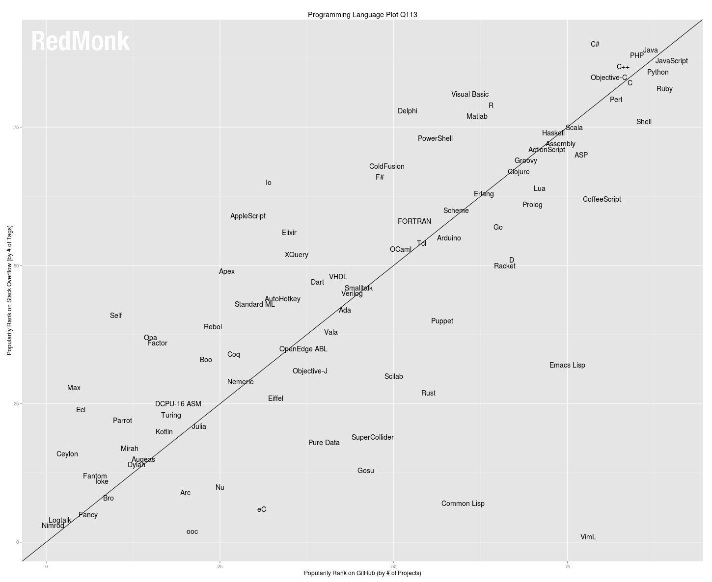
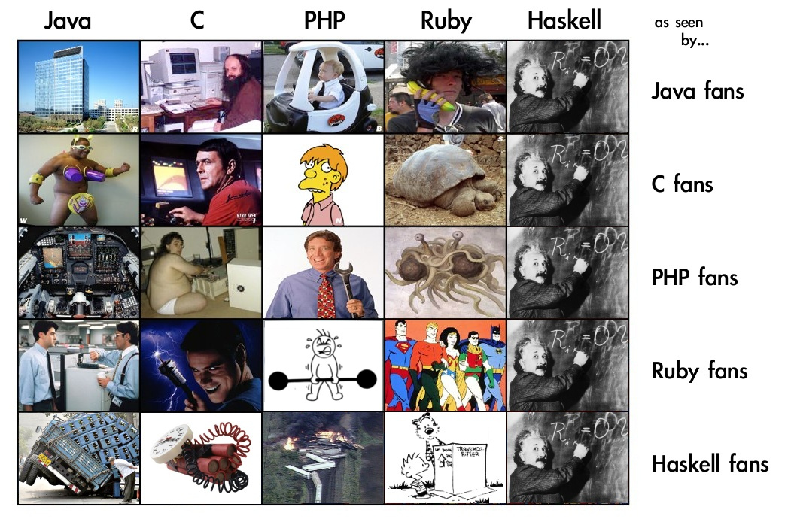
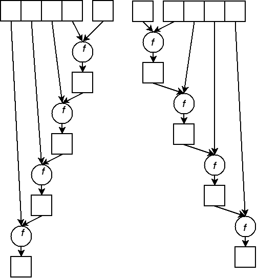
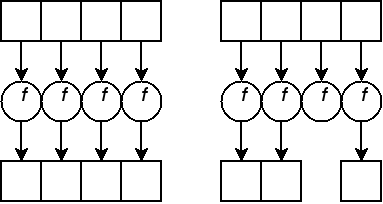

% Haskell Introduction
% Mihai Maruseac
% 8.07.2013

# Layout

* 4 days of topics
    * moving from theoretical to practical
* 1 day of hackathon
    * you can propose your own subject

# Language Popularity

# Language Matrix

# History

* 1930s, Alonzo Church, $\lambda$-calculus
* 1950s, John McCarthy, LISP
    * Scheme, Dylan, Scala, Racket
* 1960s, IPL, APL
* 1970s, FP, John Bachus
    * _Can Programming Be Liberated From the von Neumann Style? A
  Functional Style and its Algebra of Programs_
    * J
* 1970s, Robin Milner, ML
* 1970s, David Turner, Miranda
* 1990s, committee, Haskell
    * open standard for functional programming research

# Haskell

> * _Avoid success at all costs_
> * academia based language
> * ~2000: enthusiasts in various fields -> a lot of modules and libraries
> * HCAR, #haskell, The Monad Reader
> * second birth

# Users

* NASA
* Galois
* Jane Street
* Microsoft
* Facebook
* Google

# Success Stories

* Perl6 interpreter
* Hermit Reasoner
* xmonad
* Pandoc
* detexify
* grammarly

# Why

> * declarative style

~~~~ {.haskell}
sort     [] = []
sort (x:xs) = lesser ++ x : greater
    where
        lesser  = sort [ a | a <- xs, a < x]
        greater = sort [ a | a <- xs, a >=x]
~~~~

> * correctness guarantee
    * if it compiles it should be right

# Features

> * static typing
    * each expression has its own type
    * no implicit conversions
    * search-by-type, puzzle-programming
> * pure language
    * side effects segregated from pure functions
    * SPJ: _Haskell is the world's best **imperative** language_
> * concurrency made easy
    * green-threads
    * libraries (STM)
    * specialised compilers (Data Parallel Haskell)
> * lazy evaluation
> * performance

# Books

* [Learn You A Haskell](http://learnyouahaskell.com/)
* [Real World Haskell](http://book.realworldhaskell.org/)
* and others

# GHC

* _The Glorious Glasgow Haskell Compilation System, version 7.4.1_
* Haskell Platform (GHC, cabal, common libraries)
* ghc - compiler
    * ghc --make file.hs
* ghci - interpreter

# ghci interpreter

* :load, :l, :reload
* :type
* :quit

# Hands-On (1)

> * open ghci
> * test some arithmetic operations
> * test boolean operations
> * equality examples
> * type errors examples
> * calling functions (`not`, `min`)

# Infix and Prefix Functions

> * operators - infix
> * functions - prefix
> * operators made prefix: `(+)`
> * functions made infix: `` `min` ``
> * sections: `(+ 3)`, `(3 -)`, ``(`min` 42)``

# Lists

> * constructors
> * `[]`, `:`
> * `[]` - the empty list
> * `x:xs` - the list formed by appending an `x` to a list (of) `xs`
> * all elements must have the same type

# Functions (1)

* $\lambda$ expressions

~~~~ {.haskell}
sum2 = \x y -> x + y
~~~~

* explicit arguments

~~~~ {.haskell}
sum2' x y = x + y
~~~~

* mixed style

~~~~ {.haskell}
sum2'' x = \y -> x + y
sum2''' = \x -> \y -> x + y
~~~~

# Functions (2)

* curry functions
* can call with fewer arguments
* returning function asking for more arguments

# Functions (3)

* function composition

~~~~ {.haskell}
f x = 2 * x
g x = x + 4
h = f . g
~~~~

* `$` operator

~~~~ {.haskell}
f $ x = f x

(expression1) (expression2) === expression1 $ expression2
~~~~

# Functions (4)

* in Haskell, functions are _first order values_
    * list of functions
    * functions as arguments
    * functions as returned values

# List Functions (1)

~~~~ {.haskell}
sum     [] = 0
sum (x:xs) = x + sum xs
~~~~

~~~~ {.haskell}
sum     [] = 0
sum (x:xs) = (+) x (sum xs)
~~~~

~~~~ {.haskell}
sum     [] = 0
sum (x:xs) = (+) x $ sum xs
~~~~

# List Functions (2)

~~~~ {.haskell}
product     [] = 1
product (x:xs) = x * product xs
~~~~

~~~~ {.haskell}
product     [] = 1
product (x:xs) = ( * ) x $ product xs
~~~~

# List Functions (3)

~~~~ {.haskell}
length     [] = 0
length (x:xs) = 1 + length xs
~~~~

~~~~ {.haskell}
length     [] = 0
length (x:xs) = (+) 1 $ length xs
~~~~

# List Functions (4)

~~~~ {.haskell}
pattern     [] = initial_element
pattern (x:xs) = combining_function x $ pattern xs
~~~~

# List Functions (5)

* `foldl`, `foldr`

# List Functions (6)

* `map`
* `filter`

# List Functions (7)

* `take`
* `drop`
* `head`
* `tail`
* `takeWhile`
* `dropWhile`
* `zip`
* `unzip`

# List Functions (8)

~~~~ {.haskell}
map (+ 1) [1, 2, 3, 4] === [2, 3, 4, 5]
filter (> 2) [1, 3, 1, 5, 2] === [3, 5]
foldl (+) 0 [1, 2, 3, 4, 5] === 15
take 5 $ map (+ 1) [1..] === [2, 3, 4, 5, 6]
takeWhile (< 10) $ map (2 * ) [1,3 .. 100] === [2, 6]
takeWhile (< 10) $ map (2 * ) $ [1,3 .. 100] === [2, 6]
takeWhile (< 10) . map (2 * ) $ [1,3 .. 100] === [2, 6]
~~~~

# Syntax in Functions (1)

~~~~ {.haskell}
factorial x = if x < 1 then 1 else x * factorial (x - 1)
~~~~

~~~~ {.haskell}
factorial x = if x < 1
    then 1
    else x * factorial (x - 1)
~~~~

~~~~ {.haskell}
factorial x =
    | x < 1 = 1
    | otherwise = x * factorial (x - 1)
~~~~

~~~~ {.haskell}
factorial 1 = 1
factorial x = x * factorial (x - 1)
~~~~

# Syntax in Functions (2)

~~~~ {.haskell}
sum l = case l of
    [] -> 0
    (x:xs) -> x + sum xs
~~~~

~~~~ {.haskell}
length l = case l of
    (_:xs) -> 1 + length xs
    _ -> 0
~~~~

# Local Bindings

~~~~ {.haskell}
f x = let double = 2 * x in double + 1
~~~~

~~~~ {.haskell}
f x = double + 1
    where
        double = 2 * x
~~~~

# Printf Debugging

~~~~ {.haskell}
import Debug.Trace

-- trace text value

f x = trace ("f called with " ++ show x) $ x + 1
~~~~

# Hands-On (2)

* square a list
* sum the odd numbers of a list (`odd`)
* find the first perfect palindrome
* ROT13 encryption (`String`s are list of `Char`s, `ord`, `chr`)

# Hands-On (3)

* square a list

~~~~ {.haskell}
square = map (^ 2)
~~~~

* sum the odd numbers of a list

~~~~ {.haskell}
sumOdd = sum . filter odd
~~~~

# Hands-On (4)

* find the first perfect palindrome

~~~~ {.haskell}
isPerfect x = x == sumDiv x
  where
    sumDiv n = sum [ x | x <- [1..n `div` 2],
                         n `mod` x == 0]

isPalindrome x = x == (read . reverse . show $ x)

number = head $ filter both [1..]
  where
    both x = isPalindrome x && isPerfect x
~~~~

# Hands-On (5)

* ROT13 encryption

~~~~ {.haskell}
import Data.Char (ord, chr)

translate c = chr (newVal + ord 'a')
  where
    newVal = (oldVal + 13) `mod` 26
    oldVal = ord c - ord 'a'

rot13 msg = map translate msg
~~~~
