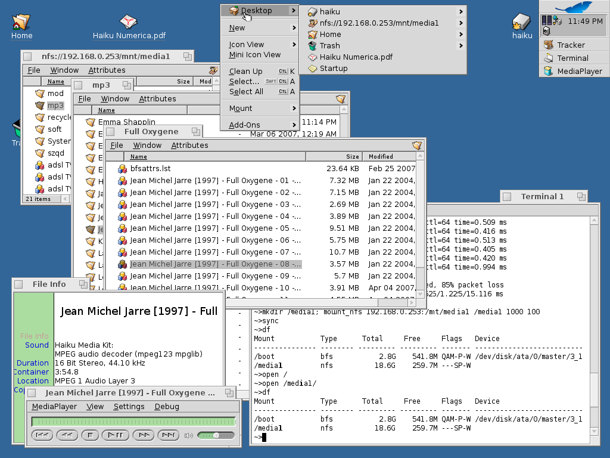

% xmonad
% Lucian Mogosanu
% July 9, 2013

# Window management

* The problem: overlapping windows

<!-- html -->

<!-- latex -->
\begin{center}
\includegraphics[width=250px]{haiku-window-mess}
\end{center}

# Window management (2)

* Possible solutions
	* Multiple workspaces
	* Exposé functionality
	* Tile on drag

# Window management (3)

* Tiling
	* All windows in the foreground
* Idea: take this to the extreme
	* **All** windows in the foreground

# Tiling window managers

* Different from desktop environments
* Minimalistic approach
	* Do only window management
	* Leave extra functionality to other software

# Tiling window managers

* Most of them run over the X11 server
* Examples
	* dwm
	* i3
	* awesome
	* xmonad

# xmonad

* Thin layer over X11 (~1000 LOC)
* Domain-specific language (DSL) for configuration
* Community modules: `xmonad-contrib`

# xmonad: installing

* Distribution-specific package

~~~~ {.bash}
$ pacman -S xmonad-contrib # Arch
$ apt-get install xmonad # Debian
$ yum install xmonad # Fedora
~~~~

* Cabal

~~~~ {.bash}
$ cabal install xmonad
~~~~

# xmonad: configuring

* Example: xmonad + MATE
* [https://github.com/fcostin/xmonad_and_mate][1]

1. Configure MATE session

~~~~ {.bash}
$ cp xmonad.desktop \
> /usr/share/applications/xmonad.desktop
$ cp xmonad-mate.desktop \
> /usr/share/xsessions/xmonad-bare.desktop
~~~~

* Edit `xmonad-bare.desktop` to start `xmonad`

2. Create `~/.xmonad/xmonad.hs` 

[1]: https://github.com/fcostin/xmonad_and_mate 

# A minimal `xmonad.hs`

~~~~ {.haskell}
import XMonad

main = do
  xmonad $ defaultConfig
    { terminal    = "mate-terminal"
    , modMask     = mod4Mask
    , borderWidth = 3
    }
~~~~

* **Mod-key** is central
	* configured as Super/Win

* `xmonad --recompile`

# Using xmonad

* **Open terminal**: mod-shift-enter
* **Navigate**: mod-tab, mod-shift-tab
	* Or mod-j, mod-k
* **Resize**: mod-h, mod-l
* **Workspaces**: mod-1, mod-2, $\dots$
* **Change tiling algorithm**: mod-space

# Updating configuration

1. Load `xmonad.hs`
2. Edit stuff...
3. mod-q

# Adding workspaces

~~~~ {.haskell}
import XMonad

main = do
  xmonad $ defaultConfig
    { terminal    = "mate-terminal"
    , modMask     = mod4Mask
    , borderWidth = 3
	, workspaces  = ["Web", "Work", "Fun"]
    }
~~~~

# xmobar

* Minimal panel

~~~~ {.bash}
$ cabal install xmobar --global
~~~~

# xmonad + xmobar

~~~~ {.haskell}
import XMonad
import XMonad.Hooks.DynamicLog

myConfig = defaultConfig
    { terminal    = "mate-terminal"
    , modMask     = mod4Mask
    , borderWidth = 3
	, workspaces  = ["Web", "Work", "Fun"]
    }

main = xmonad =<< xmobar myConfig
~~~~

# Custom keybindings

~~~~ {.haskell}
import XMonad.Util.EZConfig (additionalKeys)

myKeys = [
	((mod4Mask, xK_p), spawn "echo bla")
	]

myConfig = defaultConfig
    {
	...
    } `additionalKeys` myKeys
~~~~

* Check `.xsession-errors`

# dmenu

* X11 application launcher
* Initially created for dwm

~~~~ {.bash}
$ apt-get install dmenu
~~~~

* Make mod-p spawn dmenu

~~~~ {.haskell}
spawn "dmenu_run -nb black -nf white"
~~~~

# Conclusion?

* Previous `xmonad.hs` covers the basics
* Only scratches the surface
* Other config fields
	* `layoutHook`
		* e.g. per-workspace tiling algorithms
	* `manageHook`
		* e.g. start Skype on workspace "Work"
* Integration with DEs (Gnome, KDE etc.)

# Resources

* [http://xmonad.org/][2]
* [http://www.haskell.org/haskellwiki/Xmonad/Config_archive][3]
* [https://wiki.archlinux.org/index.php/Xmonad][4]
* [http://hackage.haskell.org/package/xmonad][5]

[2]: http://xmonad.org/
[3]: http://www.haskell.org/haskellwiki/Xmonad/Config_archive
[4]: https://wiki.archlinux.org/index.php/Xmonad
[5]: http://hackage.haskell.org/package/xmonad
