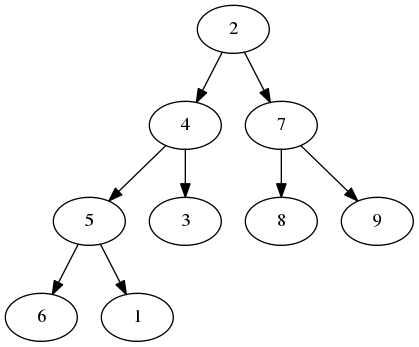

% State and Style
% Mihai Maruseac
% 11.07.2013

# A tree

~~~~ {.haskell}
data Tree a
  = Leaf a
  | Node (Tree a) a (Tree a)
  deriving (Show)
~~~~

# An example (1)

~~~~ {.haskell}
t1 = Node (Leaf 6) 5 (Leaf 1)
t2 = Node t1 4 (Leaf 3)
t3 = Node (Leaf 8) 7 (Leaf 9)
myTree = Node t2 1 t3
~~~~

# An example (2)

# Computing the minimum (1)

~~~~ {.haskell}
minTree :: Ord a => Tree a -> a
minTree (Leaf x)     = ...
minTree (Node l v r) = ...
~~~~

# Computing the minimum (2)

~~~~ {.haskell}
minTree :: Ord a => Tree a -> a
minTree (Leaf x)     = x
minTree (Node l v r) = minimum [minTree l, v, minTree r]
~~~~

# Summing the tree (1)

~~~~ {.haskell}
getTreeRoot (Leaf x)      = x
getTreeRoot (Node _ x _ ) = x

sumTree :: Num a => Tree a -> Tree a
~~~~

# Summing the tree (2)

~~~~ {.haskell}
sumTree (Leaf x)     = Leaf x
sumTree (Node l v r) = Node l' v' r'
  where
    l' = sumTree l
    r' = sumTree r
    v' = v + getTreeRoot l' + getTreeRoot r'
~~~~

# Depth of a node (1)

~~~~ {.haskell}
depthTree :: Num a => Tree t -> Tree a
~~~~

# Depth of a node (2)

~~~~ {.haskell}
depthTree t = go t 0
  where
    go (Leaf _)     d = Leaf d
    go (Node l _ r) d = Node (go l $ d + 1)
                             d
                             (go l $ d + 1)
~~~~

# Zipping two trees (1)

~~~~ {.haskell}
zipTree :: Tree t -> Tree t1 -> Tree (t, t1)
zipTree (Leaf ...) (Leaf ...) = ...
zipTree (Leaf ...) (Node ...) = ...
zipTree (Node ...) (Leaf ...) = ...
zipTree (Node ...) (Node ...) = ...
~~~~

# Zipping two trees (2)

~~~~ {.haskell}
zipTree (Leaf a)       (Leaf b)       = Leaf (a, b)
zipTree (Leaf a)       (Node _ b _)   = Leaf (a, b)
zipTree (Node _ a _)   (Leaf b)       = Leaf (a, b)
zipTree (Node l1 a r1) (Node l2 b r2) =
    Node (zipTree l1 l2) (a, b) (zipTree r1 r2)
~~~~

# Complex transformation (1)

* pair of
    * sum of children's values
    * depth of the node

~~~~ {.haskell}
complex :: (Num t1, Num t) => Tree t1 -> Tree (t1, t)
~~~~

# Complex transformation (2)

~~~~ {.haskell}
complex t = zipTree (sumTree t) (depthTree t)
~~~~

* going twice through the tree
* slight performance hit
    * more obvious on other structures
* own function

# Complex transformation (3)

~~~~ {.haskell}
complex' t = go t 0
  where
    go (Leaf x) d = Leaf (x, d)
    go (Node l v r) d = Node l' (v', d) r'
      where
        l' = go l $ d + 1
        r' = go r $ d + 1
        v' = v + fst (getTreeRoot l')
               + fst (getTreeRoot r')
~~~~

# Complex transformation (4)

* harder to read
* not composable
* harder to extend
* nested `where`

* need _state_

# A search problem (1)

* search for element satisfying a predicate

~~~~ {.haskell}
find :: (a -> Bool) -> [a] -> Maybe a
~~~~

~~~~ {.haskell}
find3
  :: (t -> Bool)
     -> [t]
     -> (t1 -> Bool)
     -> [t1]
     -> (t2 -> Bool)
     -> [t2]
     -> Maybe (t, t1, t2)
~~~~

# A search problem (2)

~~~~ {.haskell}
find3' p1 l1 p2 l2 p3 l3 =
  case find p1 l1 of
    Just t1 -> case find p2 l2 of
      Just t2 -> case find p3 l3 of
        Just t3 -> Just (t1, t2, t3)
        _ -> Nothing
      _ -> Nothing
    _ -> Nothing
~~~~

Ugly :(

# IO

* side effects
    * `putStr`, `putStrLn`, `print`
    * `getLine`, `readLn`
    * `forkIO`
    * random number generation
    * main function

~~~~ {.haskell}
main = do
  s <- getLine
  print s
~~~~

# The Monad typeclass

~~~~ {.haskell}
class Monad m where
    return :: a -> m a
    (>>=)  :: m a -> (a -> m b) -> m b
    (>>)   :: m a -> m b -> m b
    m >> n = m >>= \_ -> n

    fail   :: String -> m a
~~~~

# The Functor typeclass

~~~~ {.haskell}
class Functor f where
    fmap :: (a -> b) -> f a -> f b
~~~~

# `do` notation

~~~~ {.haskell}
                  do e -> e
       do { e; stmts } -> e >> do { stmts }
  do { v <- e; stmts } -> e >>= \v -> do { stmts }
do { let decls; stmts} -> let decls in do { stmts }
~~~~

# Monad Tutorial Fallacy

> A monad is a burrito

> A monad is just a monoid in the category of endofunctors, what's the problem?

# Maybe instance

~~~~ {.haskell}
instance Monad Maybe where
    return = Just
    (Just x) >>= g = g x
    Nothing  >>= _ = Nothing
~~~~

# Other interesting Monads

* `State`, `MonadState`
    * `get`, `put`, `modify`
* `Reader`, `Writer`
* lists
* ...

# Intuition

* computations
    * combining computations

~~~~ {.haskell}
divisorsOf :: Int -> [Int]

map divisorsOf :: [Int] -> [[Int]]

concatMap divisorsOf :: [Int] -> [Int]
~~~~

# Complex transformation (5)

~~~~ {.haskell}
transform (Leaf x) = do
  depth <- get
  return $ Leaf (x, depth)
transform (Node l v r) = do
  l' <- transform l
  r' <- transform r
  depth <- get
  let root_l = fst $ getTreeRoot l'
  let root_r = fst $ getTreeRoot r'
  return $ Node l' (v + root_l + root_r, depth) r'

complex'' t = evalState (transform t) 0
~~~~

# A search problem (3)

~~~~ {.haskell}
find3 p1 l1 p2 l2 p3 l3 = do
  t1 <- find p1 l1
  t2 <- find p2 l2
  t3 <- find p3 l3
  return (t1, t2, t3)
~~~~

# Summary

> Haskell is the world's best imperative language

Simon Peyton Jones

* monads capture control flow and common patterns
    * less boilerplate
    * more declarative style
* `MonadPlus`
* monad transformers, monad stacks
* Category Theory
* [Typeclassopedia](http://www.haskell.org/haskellwiki/Typeclassopedia)

# Typeclassopedia

