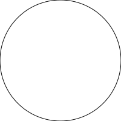
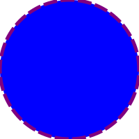
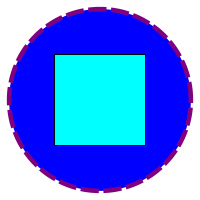
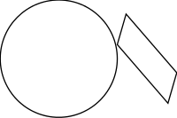
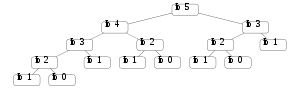
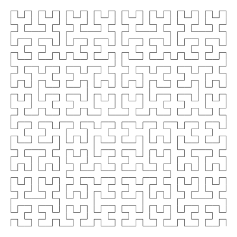

% Diagrams
% Mihai Maruseac
% 12.07.2013

# About

> * powerful
> * flexible
> * declarative
> * domain-specific language (DSL)
> * vector graphics

# Features

* vector graphics
* 2D, 3D in progress
* interactive diagrams

# Examples

~~~~ {.haskell}
{-# LANGUAGE NoMonomorphismRestriction #-}

import Diagrams.Prelude
import Diagrams.Backend.SVG.CmdLine

main = defaultMain (circle 1)
~~~~

# Examples

~~~~ {.bash}
$ ./test1 -o ../img/test1.svg -w 100
$ convert ../img/test1.svg ../img/test1.png
~~~~

# Examples

# Examples

~~~~ {.haskell}
circle1 = circle 1 # fc blue
                   # lw 0.05
                   # lc purple
                   # dashing [0.2,0.05] 0

-- x # f === f $ x
~~~~

# Examples

# Examples

~~~~ {.haskell}
circle1 = circle 1
  # fc blue
  # lw 0.05
  # lc purple
  # dashing [0.2,0.05] 0

pCircle1 = circle1 # pad 1.1
circleSq = square 1 # fc aqua `atop` pCircle1
~~~~

# Examples

# Examples

~~~~ {.haskell}
circleRect =
  circle 1 # scale 0.5
  |||
  square 1 # scaleX 0.3 
           # rotateBy (1/6) 
           # scaleX 0.5
~~~~

# Examples

# Examples

~~~~ {.haskell}
Just t = uniqueXLayout 2 2 (fibCalls 5)

example = pad 1.1 . lw 0.03 . centerXY 
        $ renderTree 
            (\n -> (text ("fib " ++ show n)
                    <> roundedRect 3 1.3 0.3 # fc white)
            )
            (~~) t
~~~~

# Examples

# Examples

~~~~ {.haskell}
hilbert = iterate expand mempty
  where
    expand t = alignBL $ hcat [u, hrule 1, reflectX u]
      where
        u = vcat [t, alignT $ vrule 1, rotateBy (3/4) t]

example = pad 1.1 . centerXY . lw 0.05 $ hilbert!!5
~~~~

# Examples

# Contribute

* [Diagrams project](http://projects.haskell.org/diagrams/)
* [Diagrams wiki](http://www.haskell.org/haskellwiki/Diagrams)
